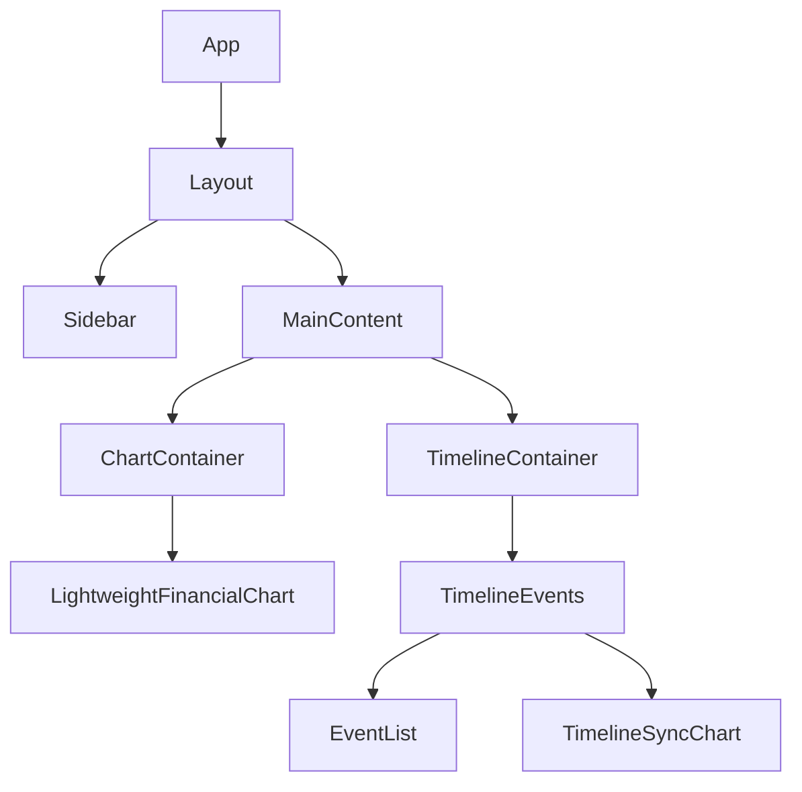

# Architecture

FinSim Pro is built as a modern React application, leveraging client-side calculation for instant feedback.

## Technology Stack

*   **Frontend Framework:** React 18+ (Vite)
*   **Language:** TypeScript
*   **State Management:** React Context + Hooks
*   **Styling:** Tailwind CSS
*   **Charting:** Lightweight Charts (TradingView)
*   **Icons:** Lucide React
*   **Drag & Drop:** @dnd-kit

## Component Hierarchy

## Core Modules

### 1. Simulation Engine
The core logic resides in `useSimulation.ts`. It:
1.  Takes the initial state (Accounts, Events).
2.  Iterates through each day of the simulation range.
3.  Applies recurring events (Income/Expenses).
4.  Calculates interest and formula effects.
5.  Generates a `SimulationPoint` array for the chart.

### 2. Timeline Sync
The `TimelineSyncChart` component ensures that the visual timeline of events aligns perfectly with the main financial chart. It shares the same X-axis (Time) scale, allowing for synchronized zooming and panning.
