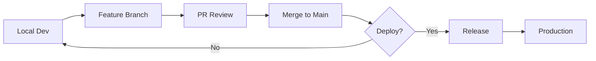
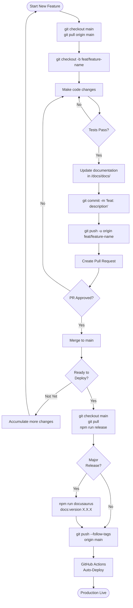
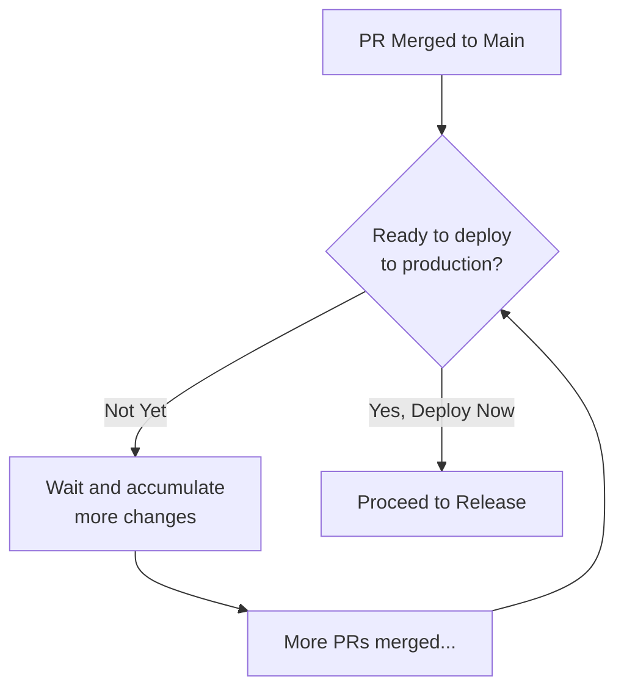
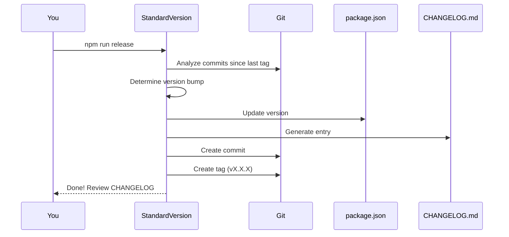
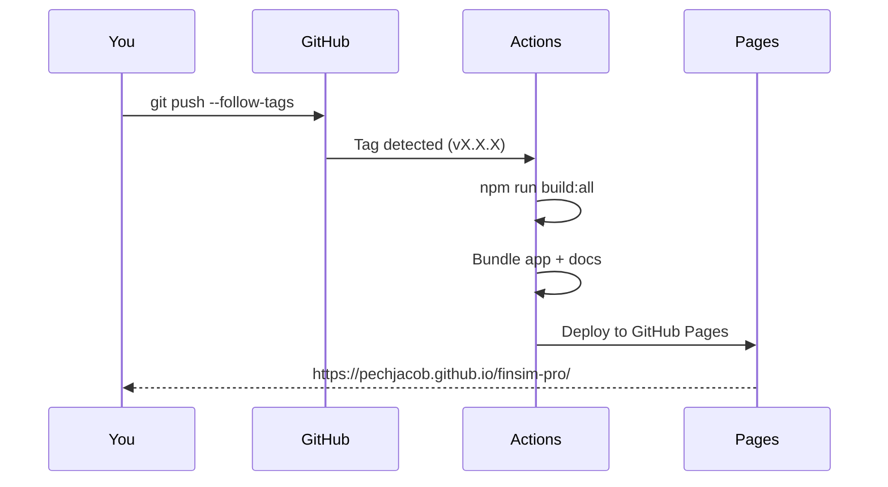

# Complete Development Workflow

This guide walks through the entire development lifecycle from creating a feature branch to deploying to production.

## Overview

The FinSim Pro workflow follows a **feature branch** model with **conventional commits** and **automated versioning**. Every change goes through code review before reaching production.



## Full Workflow Diagram



## Phase 1: Create Feature Branch

### Prerequisites
```bash
# Ensure main is up to date
git checkout main
git pull origin main
```

### Branch Naming Convention

| Prefix | Purpose | Example |
|--------|---------|---------|
| `feat/` | New feature | `feat/settings-panel` |
| `fix/` | Bug fix | `fix/chart-zoom-bug` |
| `docs/` | Documentation | `docs/api-reference` |
| `refactor/` | Code restructuring | `refactor/timeline-logic` |
| `perf/` | Performance | `perf/chart-rendering` |
| `test/` | Tests | `test/simulation-suite` |
| `chore/` | Maintenance | `chore/update-deps` |

### Create Branch
```bash
git checkout -b feat/my-awesome-feature
```

## Phase 2: Development

### Make Changes
Edit code in `/apps/finsim/src/`

### Hot Reload
Vite automatically reloads on file changes.

**When restart is needed:**
- Changing `vite.config.ts`
- Modifying `.env` variables
- Installing new dependencies

### Testing
```bash
# Type checking + linting
npm run lint

# Build verification
npm run build:all
```

**What each does:**
- `npm run lint`: TypeScript type checking + ESLint
- `npm run build:all`: Compiles app + docs (catches build errors)

## Phase 3: Documentation

### Update Docs
Edit files in `/docs/docs/` (the "Next" version):
- `/docs/docs/architecture/` - System design
- `/docs/docs/tutorials/` - How-to guides
- `/docs/docs/sdlc/` - Process documentation

These changes appear in the **Next 🚧** docs version.

## Phase 4: Commit

### Conventional Commit Format

```
<type>(<scope>): <description>

[optional body]

[optional footer]
```

**Examples:**
```bash
git commit -m "feat(app): add settings panel"
git commit -m "fix(chart): resolve zoom reset bug"
git commit -m "docs(tutorial): update getting started guide"
```

### Valid Scopes

`app`, `docs`, `chart`, `timeline`, `simulation`, `formula`, `ui`, `config`, `deps`, `ci`, `release`

### Enforcement

**Husky + Commitlint** validates your commit message:
- ✅ Valid format → Commit succeeds
- ❌ Invalid format → Commit rejected

```bash
# ❌ This will be REJECTED
git commit -m "Added new feature"

# ✅ This will be ACCEPTED
git commit -m "feat(app): add new feature"
```

### Automatic Changelog Update

After a successful commit, a **post-commit hook** automatically:
1. Analyzes commits since last tag
2. Updates the "Unreleased" section in `/docs/docs/sdlc/index.md`
3. You can view these changes in the "Next" docs version

**See:** [Changelog Automation](./changelog-automation) for details.

**Preview anytime:**
```bash
npm run changelog:preview  # View in CLI
```

## Phase 5: Push & PR

### Push Feature Branch
```bash
# First time
git push -u origin feat/my-feature

# Subsequent pushes
git push
```

**Note:** This does **NOT** trigger any deployment.

### Create Pull Request
1. Go to GitHub repository
2. Click "Compare & pull request"
3. Fill in description
4. Request review (if team member)

## Phase 6: Review & Merge

### Review Checklist
- [ ] Code follows project conventions
- [ ] Tests pass (`npm run lint` + `npm run build:all`)
- [ ] Documentation updated (if applicable)
- [ ] No merge conflicts

### Merge to Main
Click "Merge pull request" on GitHub.

## Phase 7: Release Decision



### When to Release

**Release immediately when:**
- Critical bug fix needed in production
- Major feature complete and tested
- End of sprint/milestone

**Wait to release when:**
- Minor changes that can be batched
- Feature is partial/incomplete
- Waiting for related PRs

## Phase 8: Create Release

### Check Current Version
```bash
git describe --tags
# Output: v1.1.0

# or
cat package.json | grep '"version"'
# Output: "version": "1.1.0"
```

### Run Release
```bash
git checkout main
git pull origin main
npm run release
```

### What `standard-version` Does



### Version Bump Rules

| Commit Type | Version Bump | Example |
|--------------|--------------|---------|
| `feat:` | MINOR | 1.1.0 → 1.2.0 |
| `fix:` | PATCH | 1.1.0 → 1.1.1 |
| `BREAKING CHANGE:` | MAJOR | 1.0.0 → 2.0.0 |

### Manual Override
```bash
# Force specific bump
npm run release:patch   # 1.1.0 → 1.1.1
npm run release:minor   # 1.1.0 → 1.2.0
npm run release:major   # 1.1.0 → 2.0.0
```

## Phase 9: Snapshot Docs (Optional)

**Only for major releases** (1.0.0, 2.0.0, etc.)

```bash
npm run docusaurus docs:version 1.2.0
```

This:
1. Copies `/docs/docs/` → `/docs/versioned_docs/version-1.2.0/`
2. Freezes that version
3. Creates new "Next" for future changes

**Skip for patch releases** (1.1.1, 1.1.2, etc.)

## Phase 10: Deploy

### Push Tags
```bash
git push --follow-tags origin main
```

**This triggers:**
1. Push commits to main
2. Push tags to GitHub
3. **GitHub Actions deployment** (only triggered by tags)

### Deployment Flow



### Verify Deployment
1. Wait ~2-3 minutes for Actions to complete
2. Visit: `https://pechjacob.github.io/finsim-pro/app`
3. Check version in UI (bottom-left sidebar)

## Quick Reference

| Command | Purpose |
|---------|---------|
| `git checkout -b feat/name` | Create feature branch |
| `npm run lint` | Type check + lint |
| `npm run build:all` | Build app + docs |
| `git commit -m "feat: ..."` | Conventional commit |
| `npm run changelog:preview` | View unreleased changes (CLI) |
| `git push -u origin feat/name` | Push feature branch |
## Exception: Hotfixes

For critical production bugs ONLY:
1. Create `fix/critical-description` branch
2. Make minimal fix
3. **Create Pull Request** (Required for automation)
   - Ensure title follows `fix: description`
   - Merge via PR (Squash or Rebase)
4. `npm run release:patch`
    - Creates release commit, tag, and updates changelog
5. Push with tags
   ```bash
   git push --follow-tags origin main
   ```
| `npm run release:preview` | Preview release (dry-run) |
| `npm run release` | Create version + tag |
| `npm run release:patch` | Force patch bump |
| `npm run docusaurus docs:version X.X.X` | Snapshot docs |
| `git push --follow-tags origin main` | Deploy to production |
| `git describe --tags` | Check current version |

## Troubleshooting

### Commit Rejected
```
Error: Commit message does not follow conventional format
```
**Fix:** Use proper format: `type(scope): description`

### Build Fails
```
Error: Type error in App.tsx
```
**Fix:** Run `npm run lint` locally before pushing

### Tag Already Exists
```
Error: tag 'v1.2.0' already exists
```
**Fix:** You already released this version. Check `git tag` to see all tags.

### GitHub Actions Failed
**Check:**
1. Go to GitHub → Actions tab
2. Click failed workflow
3. Read error logs
4. Common causes: Build errors, missing dependencies

## See Also

- [Changelog Automation](./changelog-automation) - Auto-updating release notes
- [Git Workflow](./workflows/git-workflow) - Detailed Git commands
- [Release Process](./versioning/release-process) - In-depth release guide
- [Conventional Commits](./workflows/npm-workflow) - Commit format reference
- [Docs Versioning](./versioning/docs-versioning) - Documentation snapshots
