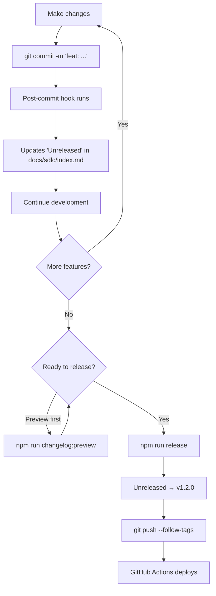

# Changelog Automation

## Overview

FinSim Pro has **two-tier** changelog automation:

1. **Post-Commit Hook**: Automatically updates "Unreleased" section in docs after every commit
2. **Release Sync**: Transforms CHANGELOG.md to clean release notes when you run `npm run release`

This means you can **always see what's in development** by viewing the "Next" docs, and the final release notes are automatically cleaned up.

## Automatic: Post-Commit Hook

### How It Works

After **every conventional commit**, a Husky post-commit hook runs:
1. Analyzes commits since last tag
2. Categorizes them (features, fixes, refactors, docs)
3. Updates `/docs/docs/sdlc/index.md` with an "Unreleased" section

### What You See

```bash
$ git commit -m "feat(app): add settings panel"

[feat/settings abc1234] feat(app): add settings panel
 1 file changed, 10 insertions(+)
✅ Updated docs/docs/sdlc/index.md with unreleased changes
```

The "Unreleased" section in `/docs/docs/sdlc/index.md`:
```markdown
## Unreleased

**Features:**
- Add settings panel

## v1.1.0 (Current)
...
```

### Viewing Unreleased Changes

Visit the **Next** version of the docs to see what's being developed:
- http://localhost:3001/finsim-pro/docs/next/sdlc/
- Or select "Next 🚧" from the version dropdown

## Manual: Preview Anytime

### CLI Preview (Option B)

View unreleased changes in your terminal **without modifying docs**:

```bash
npm run changelog:preview
```

**Output:**
```
═══════════════════════════════════════
  UNRELEASED CHANGES
  Since: v1.1.0
═══════════════════════════════════════

✨ FEATURES:
  • [app] add settings panel
  • [chart] improve zoom controls

🐛 BUG FIXES:
  • [timeline] fix crosshair alignment

═══════════════════════════════════════

💡 Tip: Run with --sync to update docs/docs/sdlc/index.md
```

### Manual Sync (If Hook Didn't Run)

If you need to manually sync (e.g., hook failed):

```bash
npm run changelog:sync
```

## Release Workflow

### 1. Before Release: Preview

```bash
npm run release:preview
```

Shows what the release will look like (dry-run):
```
✔ bumping version in package.json from 1.1.0 to 1.2.0
✔ outputting changes to CHANGELOG.md
---
## [1.2.0](https://github.com/.../compare/v1.1.0...v1.2.0) (2025-12-03)

### ✨ Features
* **app**: add settings panel (abc1234)

### 🐛 Bug Fixes
* **timeline**: fix crosshair alignment (ghi9012)
---
```

### 2. During Release: Auto-Sync

```bash
npm run release
```

What happens:
1. ✅ Analyzes commits since last tag
2. ✅ Bumps version in `package.json`
3. ✅ Generates `CHANGELOG.md` entry
4. ✅ **Transforms** CHANGELOG to clean format
5. ✅ **Updates** `/docs/docs/sdlc/index.md` (replaces "Unreleased" with version number)
6. ✅ Commits changes
7. ✅ Creates git tag

**Output:**
```bash
✔ bumping version in package.json from 1.1.0 to 1.2.0
✔ outputting changes to CHANGELOG.md
✔ committing package.json and CHANGELOG.md
✔ tagging release v1.2.0

📝 Syncing CHANGELOG to release notes...
📌 Latest version: v1.2.0
✅ Updated docs/docs/sdlc/index.md with v1.2.0
```

### 3. After Release: Verify & Push

1. **Review docs:**
   ```bash
   cat docs/docs/sdlc/index.md
   ```

2. **Amend if needed:**
   ```bash
   git add docs/docs/sdlc/index.md
   git commit --amend --no-edit
   ```

3. **Push to deploy:**
   ```bash
   git push --follow-tags origin main
   ```

## How the Transformation Works

### Post-Commit ("Unreleased" Section)
```markdown
## Unreleased

**Features:**
- Add settings panel
- Improve zoom controls
```

### After Release (Versioned)
```markdown
## v1.2.0 (Current)

**Features:**
- Add settings panel
- Improve zoom controls
```

## Workflow Diagram



## Commands Reference

| Command | Purpose | When to Use |
|---------|---------|-------------|
| `npm run changelog:preview` | View unreleased changes in CLI | Anytime you want to see what's been done |
| `npm run changelog:sync` | Manually update "Unreleased" in docs | If post-commit hook didn't run |
| `npm run release:preview` | Dry-run of full release process | Before releasing to see what version will be created |
| `npm run release` | Create release + transform to versioned docs | When ready to deploy to production |
| `npm run release:patch` | Force PATCH bump | Override auto-detection |
| `npm run release:minor` | Force MINOR bump | Override auto-detection |
| `npm run release:major` | Force MAJOR bump | Override auto-detection |

## Benefits

✅ **Always Up-to-Date** - Post-commit hook keeps "Unreleased" section current  
✅ **No Manual Work** - Automated changelog generation  
✅ **Quick Preview** - See what's being developed without switching branches  
✅ **Clean Release Notes** - Automatic transformation from verbose CHANGELOG  
✅ **Flexible** - Preview in CLI or sync to docs on demand

## Troubleshooting

### Hook Not Running

If the post-commit hook doesn't run:
```bash
# Check if husky is installed
ls .husky/

# Reinstall husky
npm run prepare

# Manually sync
npm run changelog:sync
```

### "Unreleased" Section Missing

Create it manually in `/docs/docs/sdlc/index.md`:
```markdown
# Release Notes

## Unreleased

(This section will be auto-populated after commits)

## v1.1.0 (Current)
...
```
